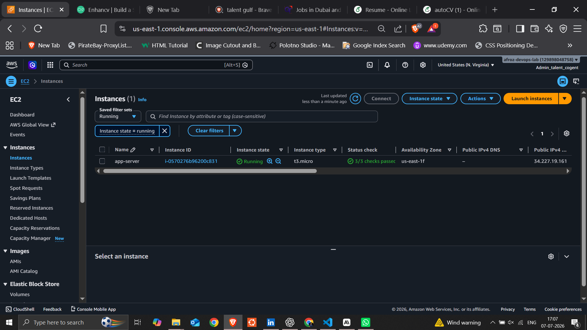
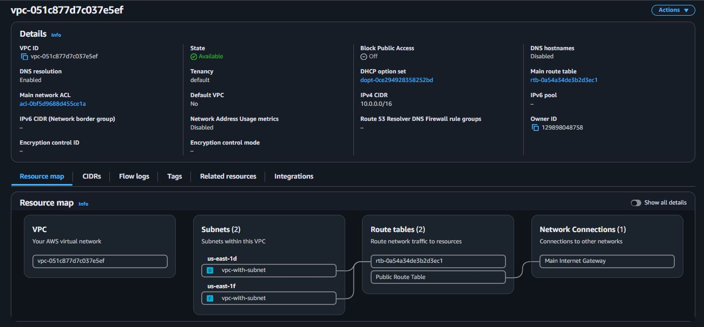
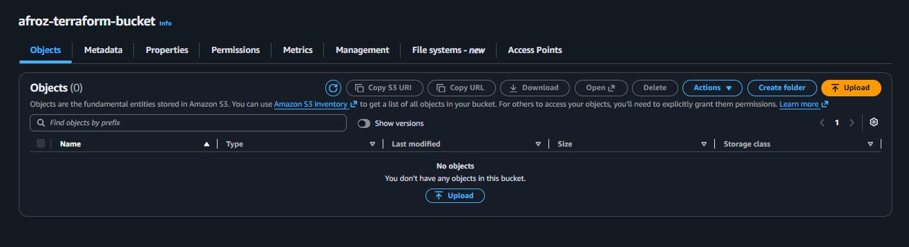
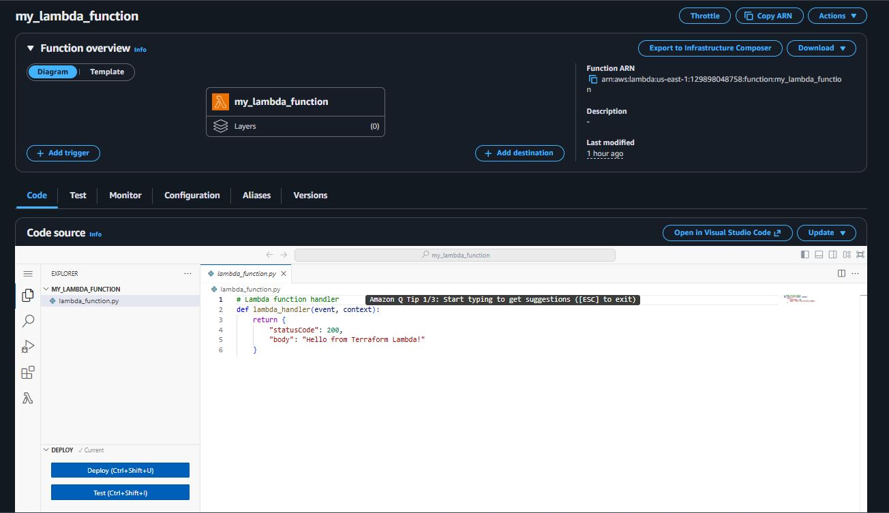
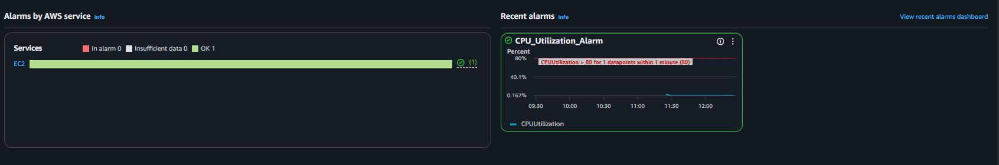
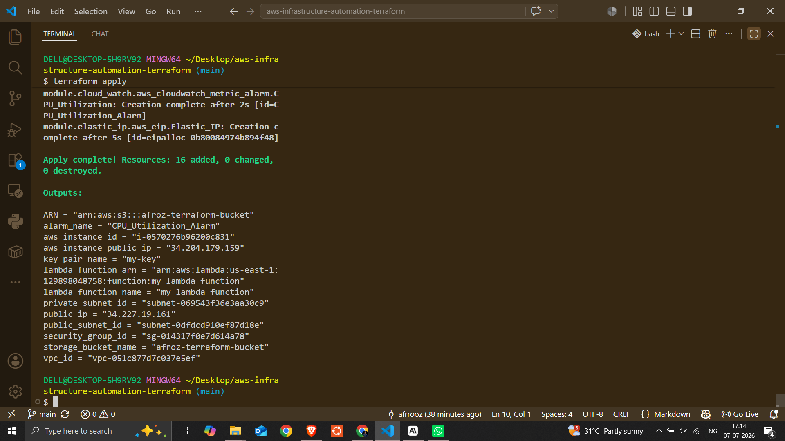

# AWS Infrastructure Automation using Terraform

## Project Overview

This project demonstrates how to automate the deployment of AWS infrastructure using **Terraform** and a modular Infrastructure as Code (IaC) approach.

Instead of manually creating resources through the AWS Management Console, this project provisions all infrastructure using reusable Terraform modules. Each AWS service is separated into its own module, making the code easy to maintain, reuse, and scale.

---

## Architecture

The project provisions the following AWS resources:

- Amazon VPC
- Public Subnet
- Private Subnet
- Internet Gateway
- Route Table
- Security Group
- EC2 Instance
- Elastic IP
- Amazon S3 Bucket
- AWS Lambda Function
- Amazon CloudWatch Alarm

---

## Project Structure

```
aws-infrastructure-automation-terraform/
│
├── modules/
│   ├── ec2/
│   ├── vpc/
│   ├── security_group/
│   ├── s3/
│   ├── lambda/
│   ├── elastic_ip/
│   └── cloudwatch/
│
├── lambda/
│   ├── lambda_function.py
│   └── lambda_function.zip
│
├── main.tf
├── variables.tf
├── outputs.tf
├── provider.tf
├── terraform.tfvars
├── versions.tf
├── .gitignore
└── README.md
```

---

## AWS Services Used

- Amazon EC2
- Amazon VPC
- Amazon S3
- AWS Lambda
- AWS IAM
- Elastic IP
- Amazon CloudWatch
- Security Groups
- Internet Gateway
- Route Tables

---

## Features

- Modular Terraform project structure
- Custom VPC with public and private subnets
- EC2 instance deployment
- Security Group allowing SSH and HTTP access
- Private S3 bucket with versioning enabled
- Lambda function deployment with IAM execution role
- Elastic IP association with EC2 instance
- CloudWatch CPU utilization monitoring
- Reusable and scalable Infrastructure as Code

---

## Modules

### VPC Module

- Creates a custom VPC
- Creates one public subnet
- Creates one private subnet
- Creates an Internet Gateway
- Configures a public route table

---

### EC2 Module

- Launches an EC2 instance
- Accepts AMI ID, instance type, key pair, subnet, and security group as input
- Outputs Instance ID and Public IP

---

### Security Group Module

- Allows inbound SSH (22)
- Allows inbound HTTP (80)
- Allows all outbound traffic

---

### S3 Module

- Creates a private S3 bucket
- Enables bucket versioning
- Blocks public access

---

### Lambda Module

- Deploys a Lambda function from a ZIP package
- Creates IAM execution role
- Attaches AWSLambdaBasicExecutionRole policy

---

### Elastic IP Module

- Allocates a static Elastic IP
- Associates it with the EC2 instance

---

### CloudWatch Module

- Creates a CPU Utilization Alarm
- Monitors the EC2 instance
- Configurable CPU threshold

---

## Prerequisites

Before deploying this project, ensure you have:

- Terraform installed
- AWS CLI configured
- AWS Account
- IAM User with required permissions

---

## Deployment

Initialize Terraform

```bash
terraform init
```

Validate configuration

```bash
terraform validate
```

Preview the execution plan

```bash
terraform plan
```

Deploy the infrastructure

```bash
terraform apply
```

Destroy the infrastructure

```bash
terraform destroy
```

---

## Outputs

After successful deployment, Terraform displays:

- EC2 Instance ID
- EC2 Public IP
- Elastic IP
- S3 Bucket Name
- S3 Bucket ARN
- VPC ID
- Public Subnet ID
- Private Subnet ID
- Security Group ID
- Lambda Function Name
- Lambda Function ARN
- CloudWatch Alarm Name
---

# Deployment Verification

The infrastructure was successfully provisioned on AWS using Terraform. The following screenshots verify the deployed resources.

## EC2 Instance

The EC2 instance was created successfully using the reusable Terraform module.



---

## Amazon VPC

A custom VPC with networking resources was provisioned.



---

## Amazon S3 Bucket

A private S3 bucket with versioning enabled was created.



---

## AWS Lambda Function

The Lambda function was deployed successfully along with its IAM execution role.



---

## Amazon CloudWatch Alarm

A CloudWatch alarm was configured to monitor EC2 CPU utilization.



---

## Terraform Apply Output

Terraform successfully created all resources and displayed the outputs.



---

## Skills Demonstrated

- Terraform
- Infrastructure as Code (IaC)
- AWS EC2
- AWS VPC
- Amazon S3
- AWS Lambda
- IAM
- CloudWatch
- Networking
- Automation
- Modular Infrastructure Design

---

## Future Improvements

- Remote Terraform State using S3
- DynamoDB State Locking
- Multiple Environments (Dev, Test, Prod)
- Auto Scaling Group
- Application Load Balancer
- GitHub Actions CI/CD Pipeline
- Terraform Workspaces

---

## Author

**Mohammed Afroz**

GitHub: https://github.com/afrrooz

LinkedIn: [linkedin.com/in/mohammedafroz-b96561221 ](https://www.linkedin.com/in/mohammed-afroz-b96561221/)